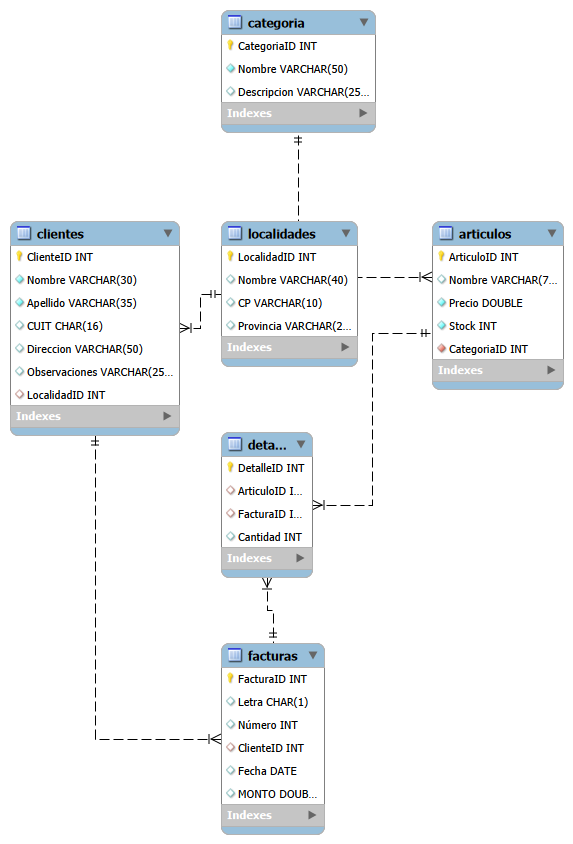

# TECNO_PRJ — Gestión de Base de Datos en MySQL

Proyecto práctico desarrollado durante un bootcamp de bases de datos. Simula el sistema de gestión de una tienda de tecnología, abarcando desde el diseño del esquema relacional hasta consultas avanzadas con funciones de cadena y agregación.

---

## Descripción

**TECNO_PRJ** es una base de datos relacional construida en MySQL que modela las operaciones comerciales de una tienda de tecnología: clientes, productos, categorías, localidades, facturas y sus detalles. El proyecto cubre el ciclo completo de trabajo con SQL: creación de tablas, modificación de estructura, inserción de datos y consultas de distinta complejidad.

---

## Estructura del proyecto

```
tecno_prj/
├── 1_create_table_tecno_prj.sql   # Creación de la base de datos y tablas principales
├── 2_alter_table.sql              # Modificaciones de estructura (ALTER TABLE, nuevas columnas y FK)
├── 3_insert_into_values.sql       # Carga de datos e incorporación de la tabla CATEGORIA
├── 4_consultas.sql                # Consultas con UNION, JOIN múltiples y filtros
└── 5_consultas_II.sql             # Funciones de cadena: CONCAT, UPPER, LEFT y cálculos
```

## 

---

## Modelo de datos

El esquema está compuesto por 6 tablas relacionadas:

| Tabla        | Descripción                                              |
|--------------|----------------------------------------------------------|
| `CLIENTES`   | Datos de clientes con CUIT, dirección y observaciones    |
| `LOCALIDADES`| Provincias y códigos postales vinculados a clientes      |
| `ARTICULOS`  | Catálogo de productos con precio, stock y categoría      |
| `CATEGORIA`  | Clasificación de artículos (10 categorías tecnológicas)  |
| `FACTURAS`   | Cabecera de comprobantes con letra, número, fecha y monto|
| `DETALLE`    | Líneas de cada factura con artículo y cantidad           |

---

## Conceptos aplicados

**DDL — Definición de estructura**
- `CREATE TABLE` con tipos de datos apropiados (`INT`, `VARCHAR`, `CHAR`, `DATE`, `DOUBLE UNSIGNED`)
- `PRIMARY KEY`, `FOREIGN KEY` y constraints de integridad referencial
- `ALTER TABLE`: modificación de columnas (`MODIFY`, `CHANGE`) y adición de claves foráneas

**DML — Manipulación de datos**
- `INSERT INTO` con valores múltiples
- Datos de prueba generados con asistencia de IA (Gemini)

**DQL — Consultas**
- `UNION` para combinar resultados de múltiples tablas
- `JOIN` encadenados (hasta 4 tablas en una sola consulta)
- Filtros con `WHERE`, `LIKE` y comparadores
- Funciones de cadena: `CONCAT`, `CONCAT_WS`, `UPPER`, `LEFT`
- Cálculos numéricos con `ROUND` para valores como IVA

---

## ▶️ Cómo ejecutar

1. Tener instalado **MySQL Server** (versión 8.0 recomendada) o usar **XAMPP / MySQL Workbench**.
2. Ejecutar los archivos en orden numérico:

```sql
-- 1. Crear la base de datos y las tablas
SOURCE 1_create_table_tecno_prj.sql;

-- 2. Modificar la estructura
SOURCE 2_alter_table.sql;

-- 3. Insertar los datos
SOURCE 3_insert_into_values.sql;

-- 4. Explorar las consultas
SOURCE 4_consultas.sql;

-- 5. Consultas con funciones
SOURCE 5_consultas_II.sql;
```

> Los archivos incluyen instrucciones `DESCRIBE` y `SHOW` comentadas que pueden activarse para verificar la estructura en cada etapa.

---

## Autor

**Gustavo Astorga**  
📎 [github.com/Gustider](https://github.com/Gustider)

